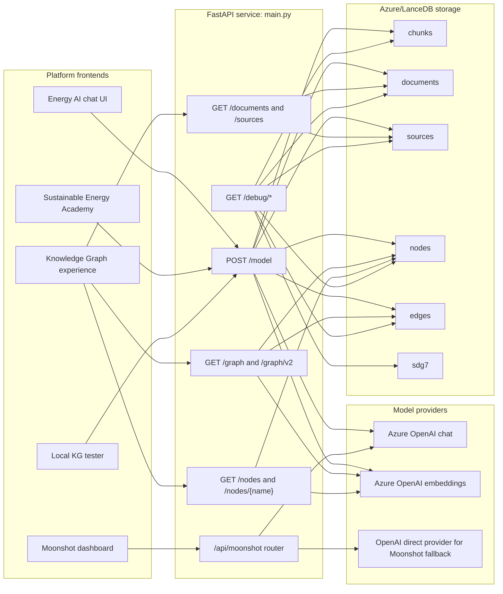
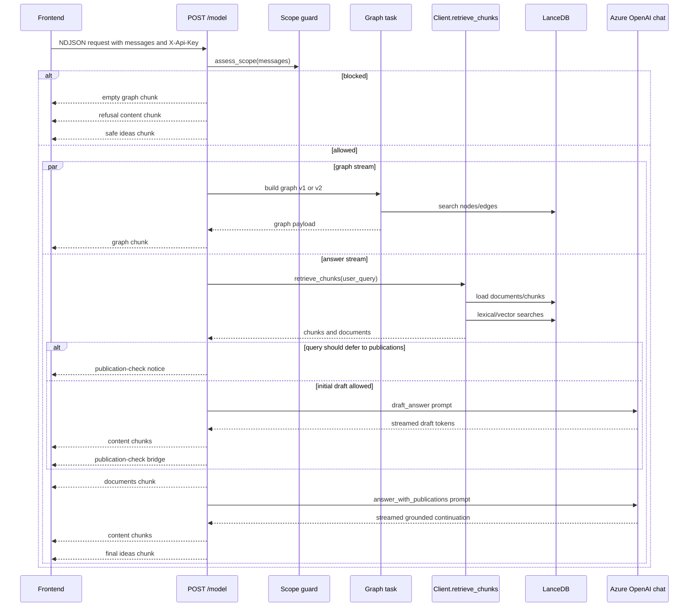
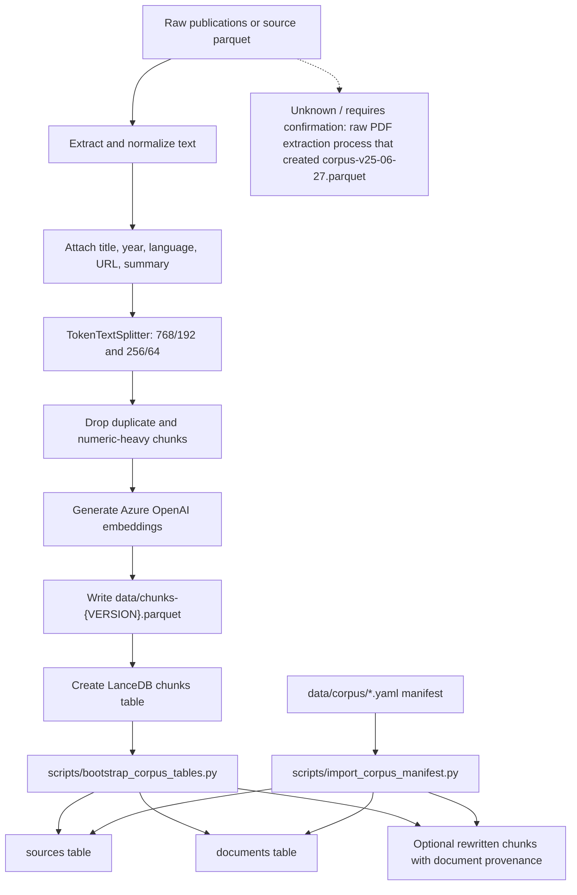
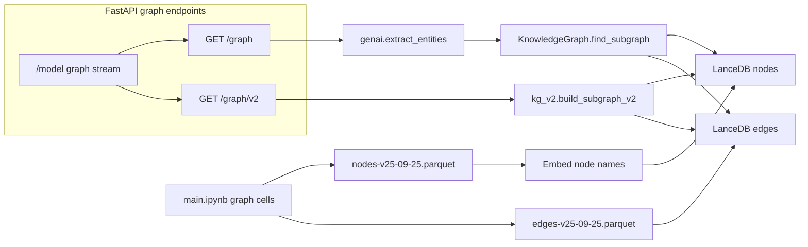
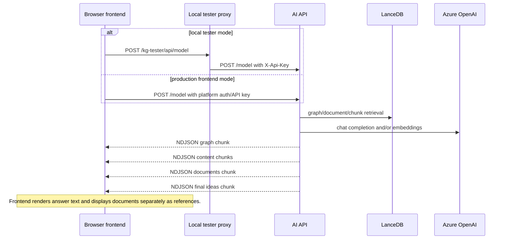

# AI API Mermaid Diagrams

## AI API Architecture

```mermaid
flowchart LR
  subgraph Frontends["Platform frontends"]
    EnergyAI["Energy AI chat UI"]
    SEA["Sustainable Energy Academy"]
    KG["Knowledge Graph experience"]
    Tester["Local KG tester"]
    MoonshotUI["Moonshot dashboard"]
  end

  subgraph API["FastAPI service: main.py"]
    Model["POST /model"]
    Nodes["GET /nodes and /nodes/{name}"]
    Graph["GET /graph and /graph/v2"]
    Docs["GET /documents and /sources"]
    Debug["GET /debug/*"]
    Moonshot["/api/moonshot router"]
  end

  subgraph AI["Model providers"]
    AzureChat["Azure OpenAI chat"]
    AzureEmbed["Azure OpenAI embeddings"]
    OpenAI["OpenAI direct provider for Moonshot fallback"]
  end

  subgraph Storage["Azure/LanceDB storage"]
    Chunks["chunks"]
    Documents["documents"]
    Sources["sources"]
    NodesTable["nodes"]
    EdgesTable["edges"]
    SDG7["sdg7"]
  end

  EnergyAI --> Model
  SEA --> Model
  KG --> Graph
  KG --> Nodes
  KG --> Docs
  Tester --> Model
  MoonshotUI --> Moonshot

  Model --> AzureChat
  Model --> AzureEmbed
  Model --> Chunks
  Model --> Documents
  Model --> Sources
  Model --> NodesTable
  Model --> EdgesTable

  Graph --> AzureEmbed
  Graph --> NodesTable
  Graph --> EdgesTable
  Nodes --> AzureEmbed
  Nodes --> NodesTable
  Docs --> Documents
  Docs --> Sources
  Debug --> Chunks
  Debug --> Documents
  Debug --> Sources
  Debug --> NodesTable
  Debug --> EdgesTable
  Debug --> SDG7

  Moonshot --> AzureChat
  Moonshot --> OpenAI
```

## RAG Request Lifecycle

```mermaid
sequenceDiagram
  participant UI as Frontend
  participant API as POST /model
  participant Guard as Scope guard
  participant Graph as Graph task
  participant Retriever as Client.retrieve_chunks
  participant LDB as LanceDB
  participant LLM as Azure OpenAI chat

  UI->>API: NDJSON request with messages and X-Api-Key
  API->>Guard: assess_scope(messages)
  alt blocked
    API-->>UI: empty graph chunk
    API-->>UI: refusal content chunk
    API-->>UI: safe ideas chunk
  else allowed
    par graph stream
      API->>Graph: build graph v1 or v2
      Graph->>LDB: search nodes/edges
      Graph-->>API: graph payload
      API-->>UI: graph chunk
    and answer stream
      API->>Retriever: retrieve_chunks(user_query)
      Retriever->>LDB: load documents/chunks
      Retriever->>LDB: lexical/vector searches
      Retriever-->>API: chunks and documents
      alt query should defer to publications
        API-->>UI: publication-check notice
      else initial draft allowed
        API->>LLM: draft_answer prompt
        LLM-->>API: streamed draft tokens
        API-->>UI: content chunks
        API-->>UI: publication-check bridge
      end
      API-->>UI: documents chunk
      API->>LLM: answer_with_publications prompt
      LLM-->>API: streamed grounded continuation
      API-->>UI: content chunks
      API-->>UI: final ideas chunk
    end
  end
```

## Document Ingestion Pipeline

```mermaid
flowchart TD
  Raw["Raw publications or source parquet"] --> Parse["Extract and normalize text"]
  Parse --> Metadata["Attach title, year, language, URL, summary"]
  Metadata --> Split["TokenTextSplitter: 768/192 and 256/64"]
  Split --> Clean["Drop duplicate and numeric-heavy chunks"]
  Clean --> Embed["Generate Azure OpenAI embeddings"]
  Embed --> ChunksParquet["Write data/chunks-{VERSION}.parquet"]
  ChunksParquet --> LanceChunks["Create LanceDB chunks table"]

  LanceChunks --> Bootstrap["scripts/bootstrap_corpus_tables.py"]
  Bootstrap --> Sources["sources table"]
  Bootstrap --> Documents["documents table"]
  Bootstrap --> EnrichedChunks["Optional rewritten chunks with document provenance"]

  Manifest["data/corpus/*.yaml manifest"] --> Import["scripts/import_corpus_manifest.py"]
  Import --> Sources
  Import --> Documents
  Import --> EnrichedChunks

  note1["Unknown / requires confirmation: raw PDF extraction process that created corpus-v25-06-27.parquet"]
  Raw -.-> note1
```

## Knowledge Graph Integration

```mermaid
flowchart LR
  Notebook["main.ipynb graph cells"] --> NodeParquet["nodes-v25-09-25.parquet"]
  Notebook --> EdgeParquet["edges-v25-09-25.parquet"]
  NodeParquet --> NodeEmbed["Embed node names"]
  NodeEmbed --> NodesTable["LanceDB nodes"]
  EdgeParquet --> EdgesTable["LanceDB edges"]

  subgraph API["FastAPI graph endpoints"]
    GraphV1["GET /graph"]
    GraphV2["GET /graph/v2"]
    ModelGraph["/model graph stream"]
  end

  GraphV1 --> Extract["genai.extract_entities"]
  Extract --> NetworkX["KnowledgeGraph.find_subgraph"]
  NetworkX --> NodesTable
  NetworkX --> EdgesTable

  GraphV2 --> KGBuilder["kg_v2.build_subgraph_v2"]
  KGBuilder --> NodesTable
  KGBuilder --> EdgesTable

  ModelGraph --> GraphV1
  ModelGraph --> GraphV2
```

## Frontend-to-AI Data Flow

```mermaid
sequenceDiagram
  participant Browser as Browser frontend
  participant Tester as Local tester proxy
  participant API as AI API
  participant LDB as LanceDB
  participant Azure as Azure OpenAI

  alt local tester mode
    Browser->>Tester: POST /kg-tester/api/model
    Tester->>API: POST /model with X-Api-Key
  else production frontend mode
    Browser->>API: POST /model with platform auth/API key
  end

  API->>LDB: graph/document/chunk retrieval
  API->>Azure: chat completion and/or embeddings
  API-->>Browser: NDJSON graph chunk
  API-->>Browser: NDJSON content chunks
  API-->>Browser: NDJSON documents chunk
  API-->>Browser: NDJSON final ideas chunk

  Note over Browser: Frontend renders answer text and displays documents separately as references.
```
